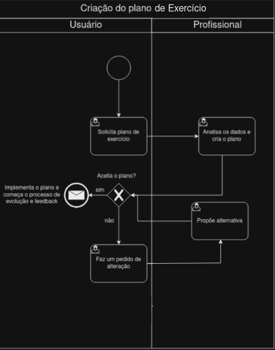

### 3.3.1 Processo 1 – CRIAR PLANO DE EXERCÍCIO

Criar plano de exercício. Esse processo visa amplificar o desempenho esperado pelo usuário de forma dinâmica com uma interface clara e objetiva. **Possíveis melhorias:** a cada determinado nível de evolução alcançada, o profissional cria um novo plano de exercício para o usuário, com o objetivo de acelerar a meta especificada pelo usuário.

**MODELO DO PROCESSO:**

#### Detalhamento das atividades

**Solicita plano de exercício**

| **Campo**           | **Tipo**         | **Restrições** | **Valor default**  |
| ---                 | ---   | ---                 | ---                 |
| Objetivo | Seleção múltipla    | Perder peso   |                     |
|  |   | Ganhar massa magra  |                     |
|  |   | Ter uma vida mais saúdavel   |                    |
| Nível de atividade atual | Seleção múltipla | 0x por semana    |                    |
|  |   | 2-3x por semana   |                    |
|  | |   4x ou mais por semana  |                    |                  |
| Sexo | Seleção única | Masculino ou Feminino    |     |
| Peso | Campo de texto |  Valores númericos    |     |
| Altura em metros | Campo de texto | Valores númericos    |     |
| Medicações em uso | Campo de texto |  Opcional   |     |
| Condições médicas pré-existentes | Campo de texto |  Opcional   |     |
| Horas de sono | Campo de texto |  Valores númericos, inteiros   |     |
| Hábitos de consumo de álcool e tabaco | Campo de texto |     |     |
| Quantas vezes deseja se exercitar por semana? |Caixa de texto    | obrigatório   |                     |
| Tempo diário para atividades físicas |Caixa de texto    | obrigatório   |                     |
| Experiência anterior em treinamento físico |Caixa de texto    | obrigatório   |                     |
| Estabelecimentos disponíveis para se exercitar (ex.: Academia, piscina...) |Caixa de texto    | obrigatório   |                     |
| Deficiências físicas ou impedimentos notáveis |Caixa de texto    | obrigatório   |                     |

| **Comandos**         |  **Destino**                   | **Tipo**          |
| ---                  | ---                            | ---               |
| Salvar      | Salva os dados gerais e destina o usuário aos dados específicos do plano de exercício             | default 
| Salvar      | Envia os dados para um profissional de exercícios          | default                     

**Analisa plano de exercício**

| **Campo**       | **Tipo**         | **Restrições**    | **Valor default** |
| ---                  | ---                            | ---               |---               |
| Objetivo (Read only) | Seleção múltipla    | Perder peso   |                     |
|  |   | Ganhar massa magra  |                     |
|  |   | Ter uma vida mais saúdavel   |                    |
| Nível de atividade atual (Read only) | Seleção múltipla | 0x por semana    |                    |
|  |   | 2-3x por semana   |                    |
|  | |   4x ou mais por semana  |                    |                  |
| Sexo | Seleção única | Read only    |     |
| Peso | Campo de texto |  Read only    |     |
| Altura em metros | Campo de texto | Read only    |     |
| Medicações em uso | Campo de texto |  Read only   |     |
| Condições médicas pré-existentes | Campo de texto |  Read only   |     |
| Horas de sono | Campo de texto |  Read only   |     |
| Hábitos de consumo de álcool e tabaco | Campo de texto |  Read only   |     |
| Quantas vezes deseja se exercitar por semana? |Caixa de texto    | Read only  |                     |
| Tempo diário para atividades físicas |Caixa de texto    | Read only  |                     |
| Experiência anterior em treinamento físico |Caixa de texto    | Read only  |                     |
| Estabelecimentos disponíveis para se exercitar (ex.: Academia, piscina...) |Caixa de texto    | Read only  |                     |
| Deficiências físicas ou impedimentos notáveis |Caixa de texto    | Read only  |     
| Plano |Caixa de texto    |   | |     

| **Comandos**         |  **Destino**                               | **Tipo**          |
| ---                  | ---                            | ---               |
| Enviar               | Validação cliente    |     default       |

**Faz um pedido de alteração**

| **Campo**                        | **Tipo**                     | **Restrições**  | **Valor default** |
| ---                              | ---                         | ---              |         ---          |
| Plano | Texto  | Não editável              |                 |
| Comentários | Texto  |                |                 |

| **Comandos**      |  **Destino**                                     | **Tipo**          |
| ---               | ---                                              | ---               |
| Aceitar | Processo de evolução e feedback    |     default       |
| Rejeitar | Alteração do profissional    |     default       |

**Propõe alternativa**

| **Campo**          | **Tipo**          | **Restrições** | **Valor default** |
| ---                  | ---                            | ---               |---               |
| Objetivo (Read only) | Seleção múltipla    | Perder peso   |                     |
|  |   | Ganhar massa magra  |                     |
|  |   | Ter uma vida mais saúdavel   |                    |
| Nível de atividade atual (Read only) | Seleção múltipla | 0x por semana    |                    |
|  |   | 2-3x por semana   |                    |
|  | |   4x ou mais por semana  |                    |                  |
| Sexo | Seleção única | Read only    |     |
| Peso | Campo de texto |  Read only    |     |
| Altura em metros | Campo de texto | Read only    |     |
| Medicações em uso | Campo de texto |  Read only   |     |
| Condições médicas pré-existentes | Campo de texto |  Read only   |     |
| Horas de sono | Campo de texto |  Read only   |     |
| Hábitos de consumo de álcool e tabaco | Campo de texto |  Read only   |     |
| Quantas vezes deseja se exercitar por semana? |Caixa de texto    | Read only  |                     |
| Tempo diário para atividades físicas |Caixa de texto    | Read only  |                     |
| Experiência anterior em treinamento físico |Caixa de texto    | Read only  |                     |
| Estabelecimentos disponíveis para se exercitar (ex.: Academia, piscina...) |Caixa de texto    | Read only  |                     |
| Deficiências físicas ou impedimentos notáveis |Caixa de texto    | Read only  |     
| Comentários feitos | Campo de Texto  | Não editável              |               |
| Plano |Caixa de texto    |   | |     

| **Comandos**         |  **Destino**                               | **Tipo**          |
| ---                  | ---                            | ---               |
| Enviar               | Validação cliente    |     default       |

