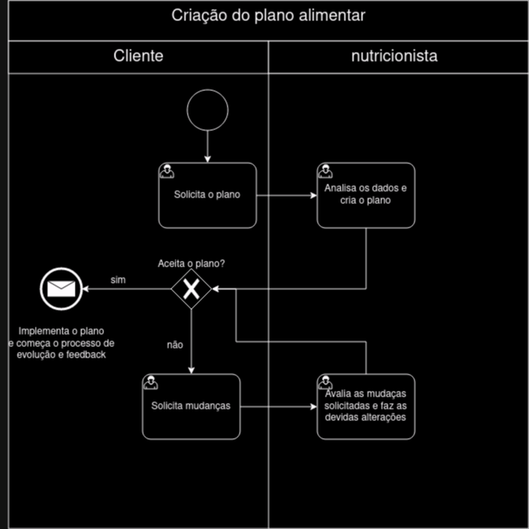

### 3.3.2 Processo 2 – Criação do Plano alimentar

Criação do Plano alimentar: Um plano alimentar desempenha um papel crucial na evolução corporal de uma pessoa, seja para perder peso, ganhar massa muscular ou simplesmente manter uma saúde ótima. Com um plano de alimentação online, pessoas com uma rotina mais cheia, podem continuar seguindo suas dietas com mais praticidade. Além de ser um plano com muitas interações sem a necessidade do usuário marcar uma consulta com um determinado profissional. **Sugestões De Melhorias:** A cada projeção de meta atingida, o profissional criar um novo plano alimentar para o usuário, visando uma melhor progressão individual do mesmo.

Processo 2 -Atual

Modelagem 2 -Atual

#### Detalhamento das atividades

**Solicitar plano alimentar**

| **Campo**       | **Tipo**         | **Restrições** | **Valor default** |
| ---             | ---              | ---             | ---              |
| Objetivo | Seleção múltipla    | Perder peso   |                     |
|  |   | Ganhar massa magra  |                     |
|  |   | Ter uma vida mais saúdavel   |                    |
| Nível de atividade atual | Seleção múltipla | 0x por semana    |                    |
|  |   | 2-3x por semana   |                    |
|  | |   4x ou mais por semana  |                    |                  |
| Sexo | Seleção única | Masculino ou Feminino    |     |
| Peso | Campo de texto |  Valores númericos    |     |
| Altura em metros | Campo de texto | Valores númericos    |     |
| Medicações em uso | Campo de texto |  Opcional   |     |
| Condições médicas pré-existentes | Campo de texto |  Opcional   |     |
| Horas de sono | Campo de texto |  Valores númericos, inteiros   |     |
| Hábitos de consumo de álcool e tabaco | Campo de texto |     |     |
| Alergias alimentares | Campo de Texto  | obrigatório            |               |
| Deficiências de vitaminas ou minerais? | Campo de Texto  | obrigatório               |               |
| Experiência anterior em dietas ou planos alimentares | Campo de Texto  | obrigatório               |               |
| Consumo de água diário | Campo de Texto  | obrigatório                |               |
| Preferências alimentares | Campo de Texto  | obrigatório              |               |

| **Comandos**         |  **Destino**                   | **Tipo** |
| ---                  | ---                            | ---      |  
| Solicitar Plano            | Criação do plano pelo nutricionista            | default  |

**Analisar os dados e criar o plano**

| **Campo**       | **Tipo**         | **Restrições** | **Valor default** |
| ---             | ---              | ---             | ---              |
| Objetivo (não editável) | Seleção múltipla    | Perder peso   |                     |
|  |   | Ganhar massa magra  |                     |
|  |   | Ter uma vida mais saúdavel   |                    |
| Nível de atividade atual (não editável)  | Seleção múltipla | 0x por semana    |                    |
|  |   | 2-3x por semana   |                    |
|  | |   4x ou mais por semana  |                    |                  |
| Sexo | Seleção única | Não editável|     |
| Peso | Campo de texto |  Não editável   |     |
| Altura em metros | Campo de texto | Não editável   |     |
| Medicações em uso | Campo de texto |  Não editável   |     |
| Condições médicas pré-existentes | Campo de texto |  Não editável   |     |
| Horas de sono | Campo de texto |  Não editável   |     |
| Hábitos de consumo de álcool e tabaco | Campo de texto |  Não editável   |     |
| Quantas vezes deseja se exercitar por semana? |Caixa de texto    | Não editável   |                     |
| Alergias alimentares | Campo de Texto  | Não editável            |               |
| Deficiências de vitaminas ou minerais? | Campo de Texto  | Não editável               |               |
| Experiência anterior em dietas ou planos alimentares | Campo de Texto  | Não editável               |               |
| Consumo de água diário | Campo de Texto  | Não editável                |               |
| Preferências alimentares | Campo de Texto  | Não editável              |               |
| Plano | Campo de Texto  |               |               |

| **Comandos**         |  **Destino**                   | **Tipo**          |
| ---                  | ---                            | ---               |
| Enviar               | Avaliação do usuário                |              |

**Solicitar o mudanças**

| **Campo**       | **Tipo**         | **Restrições** | **Valor default** |
| ---             | ---              | ---            | ---               |
| Plano | Não Editavel        |                | ---               |
| Comentários | Campo de texto        |                | ---               |

| **Comandos**         |  **Destino**                | **Tipo**          |
| ---                  | ---                         | ---               |
| Aceitar    | Inicio do processo de progressão e feedback            | default           |
| Rejeitar    | Alteração do profissional             | default           |

**Avalia as mudanças solicitadas e faz as devidas alterações**

| **Campo**       | **Tipo**         | **Restrições** | **Valor default** |
| ---             | ---              | ---            | ---               |
| Objetivo (não editável) | Seleção múltipla    | Perder peso   |                     |
|  |   | Ganhar massa magra  |                     |
|  |   | Ter uma vida mais saúdavel   |                    |
| Nível de atividade atual (não editável)  | Seleção múltipla | 0x por semana    |                    |
|  |   | 2-3x por semana   |                    |
|  | |   4x ou mais por semana  |                    |                  |
| Sexo | Seleção única | Não editável|     |
| Peso | Campo de texto |  Não editável   |     |
| Altura em metros | Campo de texto | Não editável   |     |
| Medicações em uso | Campo de texto |  Não editável   |     |
| Condições médicas pré-existentes | Campo de texto |  Não editável   |     |
| Horas de sono | Campo de texto |  Não editável   |     |
| Hábitos de consumo de álcool e tabaco | Campo de texto |  Não editável   |     |
| Quantas vezes deseja se exercitar por semana? |Caixa de texto    | Não editável   |                     |
| Alergias alimentares | Campo de Texto  | Não editável            |               |
| Deficiências de vitaminas ou minerais? | Campo de Texto  | Não editável               |               |
| Experiência anterior em dietas ou planos alimentares | Campo de Texto  | Não editável               |               |
| Consumo de água diário | Campo de Texto  | Não editável                |               |
| Preferências alimentares | Campo de Texto  | Não editável              |               |
| Comentários feitos | Campo de Texto  | Não editável              |               |
| Plano | Campo de Texto  |               |               |

| **Comandos**         |  **Destino**                | **Tipo**          |
| ---                  | ---                         | ---               |
| Enviar               | Avaliação do usuário                |              |

