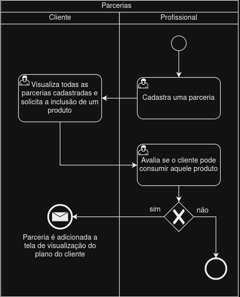

### 3.3.3 Processo 3 – Processo 3: Parcerias com restaurantes  

Parcerias com restaurantes: visando oferecer aos nossos clientes refeições com desconto e acesso à maior variedade gastronômica, a equipe do projeto healthsync sempre estará tentando aumentar o número de parcerias com restaurantes ao redor do Brasil.**Proposta de Melhoria:** Criar um cronômetro no qual o restaurante possa colocar o tempo de espera para finalização de cada refeição, dando ao cliente uma noção sobre o andamento de seu pedido.

#### Detalhamento das atividades

**Cadastra uma parceria**

| **Campo**                      | **Tipo**         | **Valor default** |
| ----                           | ----             | ----              |
| Nome       | caixa de texto            | Default           |
| Descrição            | caixa de texto   | Default           |
| Preço   | número           | Default           |

| **Comandos**                    |  **Destino**                   | **Tipo**          |
| ----                            | ----                            | ----              |
| Cadastrar parceria          | Envia uma nova parceria para o banco          |  default          |
| Visualizar lista de parcerias          |  Direciona o usuário a lista completa de parcerias      |  default          |
                                                                    

**Visualiza todas as parcerias cadastradas e solicita a inclusão de um produto**

| **Campo**                  | **Tipo**            | **Valor default** |
| ----                       | ----                | ----              |
| Nome       | caixa de texto            | Default           |
| Descrição            | caixa de texto   | Default           |
| Preço   | número           | Default           |
                                                                
| **Comandos**                    |  **Destino**                   | **Tipo**          |
| ----                            | ----                            | ----              |
| Solicitar inclusão ao plano alimentar         | Envia um pedido de inclusão à um nutricionista        |  default          |

**Avalia se o cliente pode consumir aquele produto**

| **Campo**                  | **Tipo**            | **Valor default** |
| Objetivo (Read only) | Seleção múltipla    | Perder peso   |                     |
|  |   | Ganhar massa magra  |                     |
|  |   | Ter uma vida mais saúdavel   |                    |
| Nível de atividade atual (Read only) | Seleção múltipla | 0x por semana    |                    |
|  |   | 2-3x por semana   |                    |
|  | |   4x ou mais por semana  |                    |                  |
| Sexo | Seleção única | Read only    |     |
| Peso | Campo de texto |  Read only    |     |
| Altura em metros | Campo de texto | Read only    |     |
| Medicações em uso | Campo de texto |  Read only   |     |
| Condições médicas pré-existentes | Campo de texto |  Read only   |     |
| Horas de sono | Campo de texto |  Read only   |     |
| Hábitos de consumo de álcool e tabaco | Campo de texto |  Read only   |     |
| Quantas vezes deseja se exercitar por semana? |Caixa de texto    | Read only  |                     |
| Tempo diário para atividades físicas |Caixa de texto    | Read only  |                     |
| Experiência anterior em treinamento físico |Caixa de texto    | Read only  |                     |
| Estabelecimentos disponíveis para se exercitar (ex.: Academia, piscina...) |Caixa de texto    | Read only  |                     |
| Deficiências físicas ou impedimentos notáveis |Caixa de texto    | Read only  |   
| Preço   | número           | Default           |
                                                                
| **Comandos**                    |  **Destino**                   | **Tipo**          |
| ----                            | ----                            | ----              |
| Aceitar         | Adiciona o produto parceiro à visualização de plano do cliente       |  default          |
| Rejeitar         | Fim do processo    |  default          |
                                                                    