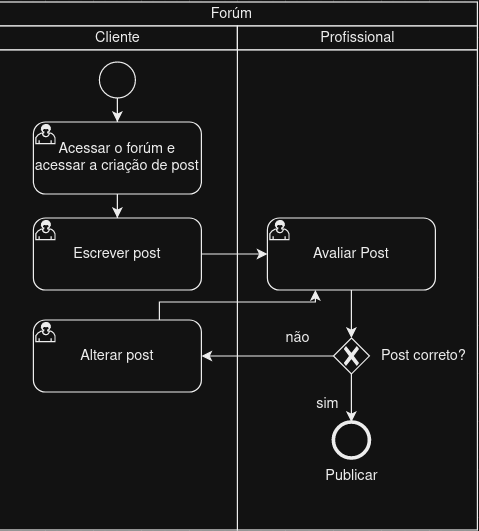

### 3.3.4 Processo 4 – Forúm

Fórum de Saúde Validado: Com o objetivo de fornecer informações confiáveis, apoio emocional e criar uma comunidade de aprendizado, este fórum capacita pacientes, educa profissionais de saúde e contribui para a promoção da saúde pública. É um espaço onde os usuários podem compartilhar informações, dicas e experiências relacionadas à saúde, enquanto profissionais de saúde têm a oportunidade não apenas de validar as informações, mas também de sugerir melhorias e fornecer orientações especializadas. Esta plataforma desempenha um papel crucial ao reunir a expertise dos profissionais e a experiência dos pacientes, promovendo assim uma compreensão mais abrangente e segura das questões de saúde.

#### Detalhamento das atividades

**Acessar o forúm e acessar a criação de post**

| **Campo**           | **Tipo**          | **Restrições** | **Valor default** |
| ---                 | ------------------| -----------------------| ---               |
| Posts já publicados | Seleção multipla  |  |   |
| Filtro de categorias | Seleção multipla  | Nutrição/Exercícios/outras |   |

| **Comandos**         |  **Destino**                   | **Tipo** |
| ---                  | ---                            | ---      |
|  Criar post           | Tela para criação de post            |  default |
|  Meus posts          | Tela para "filtro" de posts por autor     |  default |
|  Acessar post         | Tela visualização de post já publicado   |  default |

**Escrever post**

| **Campo**        | **Tipo**         | **Restrições**        | **Valor default** |
| ---              | ---              | ---                   | ---               |
| Título     | Caixa de texto   |   |                   |
| Subtítulo | Área de texto    |                       |                   |
| Categoria | Seleção múltipla           |  Nutrição/Exercícios/outras |                   |
| Conteúdo do post      | Caixa de texto             |                       |                   |

| **Comandos**         |  **Destino**                   | **Tipo**          |
| ---                  | ---                            | ---               |
| Enviar             | Avaliação de um profissional     |  default          |

**Avaliar Post**

| **Campo**                | **Tipo**         | **Restrições**        | **Valor default** |
| ---                      | ---              | ---                   | ---               |
| Comentários | Área de texto    |                       |                   |
| Título     | Caixa de texto   | Read only  |                   |
| Subtítulo | Área de texto    |  Read only                      |                   |
| Categoria | Seleção múltipla           |  Nutrição/Exercícios/outras e Read only |                   |
| Conteúdo do post      | Caixa de texto             |     Read only                  |                   |

| **Comandos**         |  **Destino**                   | **Tipo**          |
| ---                  | ---                            | ---               |
| Aceitar   | Envia o post para a tela inicial do forúm como "publicado" e leva o avaliador ao seu dashboard                 |  default          |
| Rejeitar   | Envia o post de volta para o usuário para efetuar as correções e leva o avaliador ao seu dashboard                 |  default          |

**Alterar post**

| **Campo**                | **Tipo**         | **Restrições**        | **Valor default** |
| ---                      | ---              | ---                   | ---               |
| Comentários | Área de texto    |      Read only      |                   |
| Título     | Caixa de texto   |  |                   |
| Subtítulo | Área de texto    |  |                   |
| Categoria | Seleção múltipla           |  Nutrição/Exercícios/outras|                   |
| Conteúdo do post      | Caixa de texto             |      |                   |

| **Comandos**         |  **Destino**                   | **Tipo**          |
| ---                  | ---                            | ---               |
| Enviar             | Avaliação de um profissional     |  default          |

