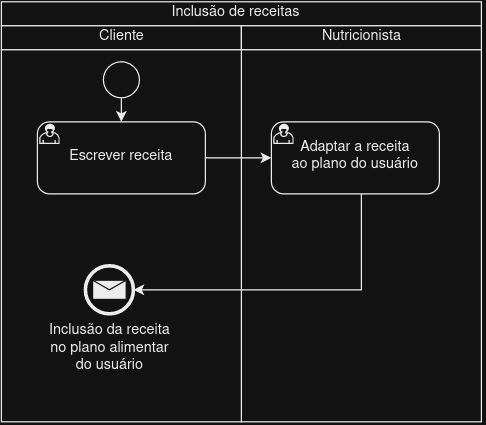

### 3.3.5 Processo 5 – Validação de receitas
Esse processo visa a busca por uma saúde mais eficaz e segura, garantindo que os pacientes recebam orientações e prescrições confiáveis, alinhadas com suas necessidades individuais, levando informações seguras e confiáveis para todos, proporcionando assim maior conveniência e qualidade de vida para os pacientes. 

Diagrama processo 5 -Atual

#### Detalhamento das atividades

**Escrever receita**

| **Campo**       | **Tipo**         | **Restrições** | **Valor default** |
| ---             | ---              | ---            | ---               |
|     Nome da receita     |  Area de texto  |  |                  |
|     Calorias presentes na receita   |  Area de texto  |  |                  |
|     Gramas de proteinas presentes na receita   |  Area de texto  |  |                  |
|     Ingredientes   |  Area de texto  |  |                  |
|     Modo de preparo   |  Area de texto  |  |                  |

| **Comandos**         |  **Destino**                   | **Tipo**          |
| ---                  | ---                            | ---               |
| Enviar receita       | Avaliação do profissional         |  default          |

**Avaliar receita**

| **Campo**       | **Tipo**         | **Restrições** | **Valor default** |
| ---             | ---              | ---            | ---               |
|     Nome da receita     |  Area de texto  |   |                  |
|     Calorias presentes na receita   |  Area de texto  |   |                  |
|     Gramas de proteinas presentes na receita   |  Area de texto  |   |                  |
|     Ingredientes   |  Area de texto  |   |                  |
|     Modo de preparo   |  Area de texto  |   |                  |

| **Comandos**         |  **Destino**                   | **Tipo** |
| ---                  | ---                            | ---               |
| Enviar              | Incluir no plano alimentar     | default           |