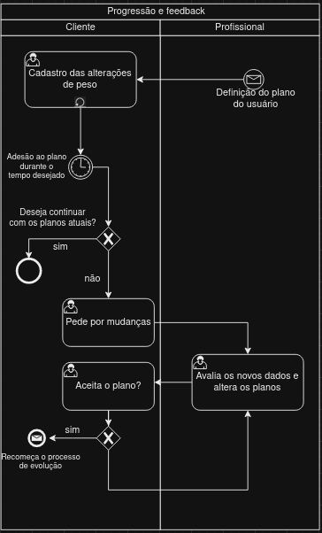

### 3.3.6 Processo 6 – Feedback e acompanhamento da evolução do usuário

No cenário atual, existe uma lacuna clara no processo de feedback do usuário quanto a sua experiência seguindo os planos nutricionais e de exercicio criados em outras plataformas. O projeto visa melhorar esse processo trazendo uma interface clara, intuitiva e envolvente para o usuário, mantendo o acompanhamento profissional para além do momento inicial em que esses planos são definidos.

Depois da criação do planos, o profissional tem acesso aos dados do cliente e consegue definir métricas e objetivos, e com esses, o cliente consegue avaliar se seu progresso está de acordo com o planejado ou se alterações são necessárias. 

Modelo processo 6

  

#### Detalhamento das atividades
**Cadastro das alterações de peso**

| **Campo**       | **Tipo**         | **Restrições** | **Valor default** |
| ---             | ---              | ---            | ---               |
| Peso atual | Valores numérios  | peso em KG||
| Grafíco para a visualização da progressão | Gráfico | Peso no eixo Y e datas no eixo X||

| **Comandos**         |  **Destino**                   | **Tipo** |
| ---                  | ---                            | ---               |
| Salvar | Envio do peso atual para persistência | default |

**Pede por mudanças**

| **Campo**       | **Tipo**         | **Restrições** | **Valor default** |
| ---             | ---              | ---            | ---               |
| Checkbox para pedido de mudança do Plano alimentar | Checkbox  | |   | 
| Checkbox para pedido de mudança do Plano de exercícios | Checkbox  | |   | 
| Comentários | área de texto  | |   | 

| **Comandos**         |  **Destino**                   | **Tipo**          |
| ---                  | ---                            | ---               |
| Pedir novos planos | Modal para pedido de mudanças | default |
| Enviar pedido | Usuário é direcionado ao dashboard e o pedido é enviado aos devidos profissionais | default |

**Avalia os novos dados e altera os planos**

| **Campo**       | **Tipo**         | **Restrições** | **Valor default** |
| ---             | ---              | ---            | ---               |
| Objetivo (Read-only) | Seleção múltipla    | Perder peso   |                     |
|  |   | Ganhar massa magra  |                     |
|  |   | Ter uma vida mais saúdavel   |                    |
| Nível de atividade atual (Read-only)| Seleção múltipla | 0x por semana    |                    |
|  |   | 2-3x por semana   |                    |
|  | |   4x ou mais por semana  |                    |                  |
| Sexo | Seleção única | Masculino ou Feminino (Read-only)   |     |
| Peso | Campo de texto |  Valores númericos   (Read-only) |     |
| Altura em metros | Campo de texto | Valores númericos  (Read-only)  |     |
| Medicações em uso | Campo de texto |  Read-only   |     |
| Condições médicas pré-existentes | Campo de texto |  Read-only   |     |
| Horas de sono | Campo de texto |  Valores númericos, inteiros, Read-only   |     |
| Hábitos de consumo de álcool e tabaco | Campo de texto |   Read-only  |     |
| Quantas vezes deseja se exercitar por semana? |Caixa de texto    | Read-only   |                     |
| Tempo diário para atividades físicas |Caixa de texto    | Read-only   |                     |
| Experiência anterior em treinamento físico |Caixa de texto    | Read-only   |                     |
| Estabelecimentos disponíveis para se exercitar (ex.: Academia, piscina...) |Caixa de texto    | Read-only   |                     |
| Deficiências físicas ou impedimentos notáveis |Caixa de texto    | Read-only   |                     |
| Alergias alimentares | Campo de Texto  | Read-only            |               |
| Deficiências de vitaminas ou minerais? | Campo de Texto  | Read-only               |               |
| Experiência anterior em dietas ou planos alimentares | Campo de Texto  | Read-only               |               |
| Consumo de água diário | Campo de Texto  | Read-only                |               |
| Preferências alimentares | Campo de Texto  | Read-only              |               |
| Comentários| Campo de Texto  | Read-only              |               |
| Plano | Campo de Texto  |            |               |

| **Comandos**         |  **Destino**                   | **Tipo**          |
| ---                  | ---                            | ---               |
| Enviar | Avaliação do usuário  | default |

**Aceita o plano?**

| **Campo**       | **Tipo**         | **Restrições** | **Valor default** |
| ---             | ---              | ---            | ---               |
| Plano | Campo de Texto   | Read-only  | |
| Comentários | Campo de Texto   |     | |

| **Comandos**         |  **Destino**                   | **Tipo**          |
| ---                  | ---                            | ---               |
| Aceitar | Inicio do processo de evolução e feedback  | default |
| Rejeitar | Envio dos comentários ao devido profissional  | default |