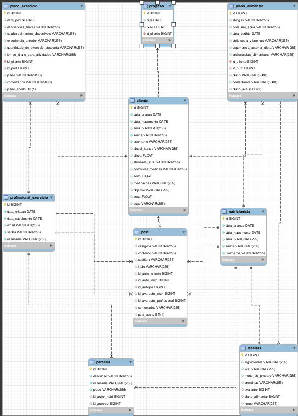
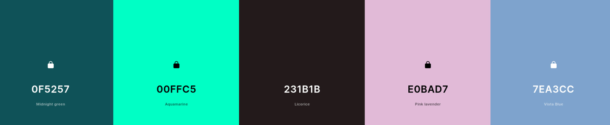

## 4. Projeto da solução

### 4.1. Modelo de dados

### 4.2. Tecnologias
Utilizaremos HTML, CSS, JS para a criação da interface do usuário. HTML é utilizado para a construção da página, o CSS é utilizado para estilizar a página e JS é utilizado para adicionar interatividade na UI.

A persistência de dados será utilizado com o Hibernate, que é compátivel com o MySQL e facilita a interação com este banco relacional.

Para realizar a parte lógica do negócio utilizaremos o Java SpringBoot é um framework em JAVA que ajudará na simplificação de desenvolvimento do projeto. 

Log4J será utilizado para o monitoramento e solução de problemas no sistema.

O Teste será realizado pelo JUnit, que é um framework de teste unitário do JAVA. Ajudará na criação de testes automatizados, que garantirão a execução correta do código.

O Banco de Dados escolhido foi o MySQL, que irá armazenar e recuperar dados de forma eficiente.

O Projeto será hospedado no GitHub Pages, onde colocaremos nosso projeto para a visualização de demais usuários

**EXPLICAÇÃO DO RELACIONAMENTO DAS TECNOLOGIAS**

O usuário interage com a aplicação através do navegador web, enviando solicitações HTTP para o servidor.

O servidor Spring Boot recebe as solicitações do usuário e processa-as.

O Spring Boot interage com o banco de dados MySQL por meio do Hibernate para recuperar ou armazenar dados, conforme necessário.

O Log4J registra eventos importantes e mensagens de log para fins de monitoramento e solução de problemas.

Os testes automatizados JUnit são executados periodicamente para garantir a integridade do código.

A aplicação front-end (HTML+CSS+JS) é hospedada no GitHub Pages e é carregada no navegador do usuário, permitindo a interação com a aplicação.

O resultado da interação do usuário com a aplicação é exibido na interface do usuário, com respostas e feedback fornecidos ao usuário.

| **Dimensão**   | **Tecnologia**  |
| ---            | ---             |
| Persistência   | Hibernate       |
| Front end      | HTML + CSS (Bootstrap) + JS     |
| Back end       | Java SpringBoot |
| Log do sistema | Log4J           |
| Teste          | JUnit           |
| Banco de Dados          | MySql           |
| Deploy         | Github Pages    |

### 4.3. Guias de estilo

_Layout padrão do site (HTML e CSS) que será utilizado em todas as páginas com a definição de identidade visual, aspectos de responsividade e iconografia._

_Explique as guias de estilo utilizadas no seu projeto._

## Design

Para padronizar os menus e o posicionamento de informações foi feito um wireframe pelo figma, no qual o visual completo do site e suas páginas foi criado e estilizado. A partir deste a pagína web foi desenvolvida, seguindo o estilo do wireframe. 

Wireframe: (https://www.figma.com/community/file/1291366465060495957)

## Cores

#231B1B - Background padrão

#00FFC5 - Detalhes

#E0BAD7 - Detalhes

#7EA3CC - Detalhes

#0F5257 - Menu, botões, Detalhes ou divisões de conteúdo

#FFFFFF - Letras

#FF2C2C - botões de cancelar ou outras ações negativas

## Tipografia

Título de página ou seção - Allura regular

Corpo de texto - Roboto Light

## Iconografia

_Defina os ícones que serão utilizados e suas respectivas funções._

_Apresente os estilos CSS criados para cada um dos elementos apresentados.
Outras seções podem ser adicionadas neste documento para apresentar padrões de componentes, de menus, etc._

Logo

> **Links Úteis**:
>
> - [Como criar um guia de estilo de design da Web](https://edrodrigues.com.br/blog/como-criar-um-guia-de-estilo-de-design-da-web/#)
> - [CSS Website Layout (W3Schools)](https://www.w3schools.com/css/css_website_layout.asp)
> - [Website Page Layouts](http://www.cellbiol.com/bioinformatics_web_development/chapter-3-your-first-web-page-learning-html-and-css/website-page-layouts/)
> - [Perfect Liquid Layout](https://matthewjamestaylor.com/perfect-liquid-layouts)
> - [How and Why Icons Improve Your Web Design](https://usabilla.com/blog/how-and-why-icons-improve-you-web-design/)
